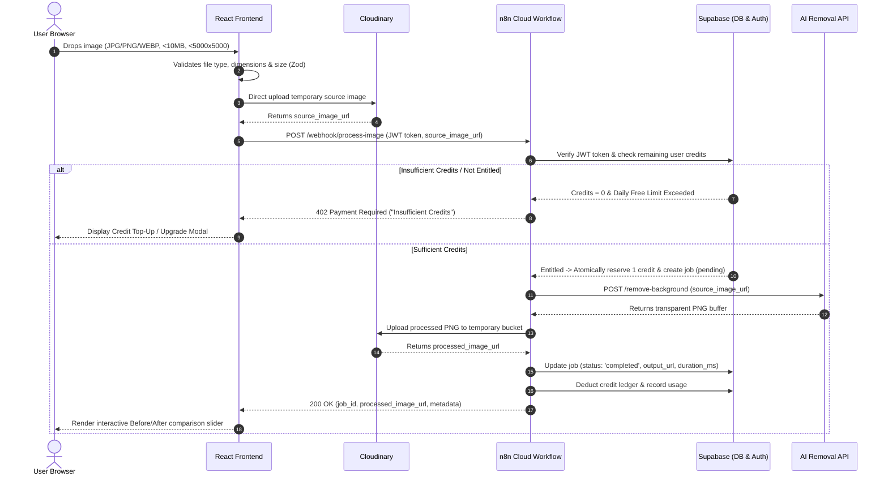
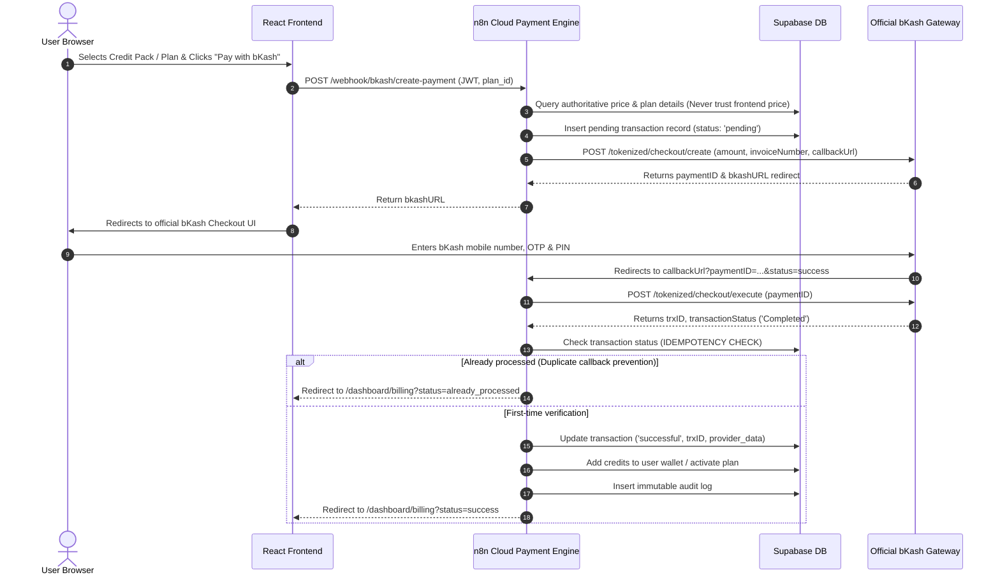
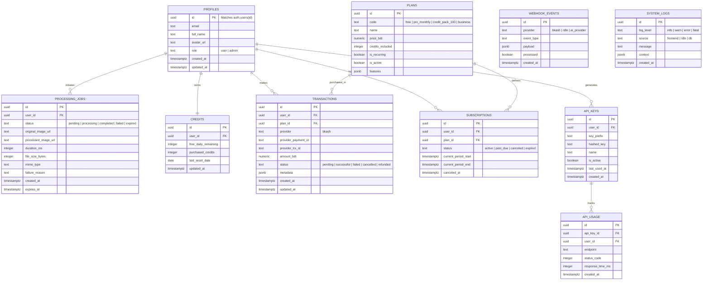

# SnapCut AI — System Architecture Specification

## 1. Executive Summary & Architecture Philosophy

**SnapCut AI** is a production-grade AI SaaS platform engineered for one-click image background removal, optimized initially for the Bangladesh market (with native bKash Payment Gateway integration) and structured for seamless international expansion.

### Core Architectural Principles
1. **Serverless & Managed Stack**: Eliminates fragile VPS hosting, container management overhead, and custom server maintenance. We use **React/Vite (Frontend)** + **Supabase (Auth & DB)** + **n8n Cloud (Automation & Business Logic Engine)** + **Cloudinary (Ephemeral Storage)** + **AI Providers** + **bKash (Payment)** + **Vercel (Edge Hosting)**.
2. **Zero-Trust Client Boundary**: The frontend is treated strictly as an untrusted UI presentation layer. All credit deductions, plan pricing verification, AI provider keys, and payment confirmations execute in secure, trusted serverless environments (n8n Cloud & Supabase PostgreSQL RLS / Database functions).
3. **Ephemeral Privacy-First Media Storage**: SnapCut AI strictly avoids permanent user image retention. All user uploads and transparent output PNGs reside in temporary Cloudinary buckets configured with a strict 24-hour maximum auto-purge lifecycle.

---

## 2. High-Level System Architecture

```mermaid
flowchart TD
    subgraph ClientLayer ["Client Presentation Layer (Vercel Edge)"]
        UserBrowser["User Browser / Mobile Device"]
        ReactApp["SnapCut AI Frontend (React + Vite + TS + Tailwind)"]
        UserBrowser <--> ReactApp
    end

    subgraph AuthAndDataLayer ["Identity & Persistence Layer (Supabase)"]
        SupaAuth["Supabase Auth (JWT / OAuth / Sessions)"]
        SupaDB[("Supabase PostgreSQL (RLS Protected Tables)")]
        ReactApp <-->|Direct Auth & User Queries via RLS| SupaAuth
        ReactApp <-->|Direct Safe Queries via Anon Key + RLS| SupaDB
    end

    subgraph MediaLayer ["Ephemeral Media Layer (Cloudinary)"]
        CloudinaryCDN["Cloudinary Ephemeral Bucket (24h Auto-Purge)"]
        ReactApp -->|Direct Temporary Image Upload| CloudinaryCDN
    end

    subgraph AutomationLayer ["Business Logic & Orchestration Layer (n8n Cloud)"]
        n8nWebhook["n8n Secure Webhooks"]
        JobOrchestrator["Job Orchestrator & Entitlement Verifier"]
        bKashWorkflow["bKash Payment Verifier (Idempotent)"]
        APIKeyWorkflow["Developer API Gateway Engine"]
        
        n8nWebhook --> JobOrchestrator
        n8nWebhook --> bKashWorkflow
        n8nWebhook --> APIKeyWorkflow
    end

    subgraph ExternalServices ["External Specialized APIs"]
        AI_API["Third-Party AI Background Removal Engine"]
        bKashPGW["Official bKash Merchant Payment Gateway"]
    end

    ReactApp -->|Dispatches Job Request with JWT & Image URL| n8nWebhook
    JobOrchestrator <-->|Validates Entitlements & Deducts Credits| SupaDB
    JobOrchestrator -->|Fetches Ephemeral Image & Requests Removal| AI_API
    AI_API -->|Returns Cutout PNG| JobOrchestrator
    JobOrchestrator -->|Uploads Transparent PNG Result| CloudinaryCDN
    JobOrchestrator -->|Updates Job Record (Completed / Failed)| SupaDB
    JobOrchestrator -->>|Returns Result JSON to Frontend| ReactApp

    ReactApp -->|Initiates Plan Purchase| n8nWebhook
    bKashWorkflow <-->|Creates bKash Payment URL| bKashPGW
    bKashPGW -->|Payment Callback / Return URL| bKashWorkflow
    bKashWorkflow <-->|Query Payment Status & Verify Signature| bKashPGW
    bKashWorkflow <-->|Idempotent Credit Addition / Transaction Log| SupaDB
```

---

## 3. Technology Stack & Responsibilities

| Domain | Technology | Core Responsibility |
| :--- | :--- | :--- |
| **Frontend Framework** | React 19 + Vite + TypeScript | Lightning-fast SPA rendering, type safety, modular component tree |
| **Styling & Design System** | Tailwind CSS + Shadcn UI + Lucide | Curated dark theme palette, responsive layouts, accessible UI primitives |
| **Client State** | Zustand | Global UI state (theme, active modals, upload queues, notification toasts) |
| **Server State & Cache** | TanStack Query (React Query) | Cache invalidation, query synchronization, optimistic UI updates |
| **Forms & Validation** | React Hook Form + Zod | Client-side input validation, file size/mime-type enforcement, schema typing |
| **Hosting & Edge CDN** | Vercel | Global CDN deployment, instant previews, SSL, Edge routing |
| **Auth & Authorization** | Supabase Auth (GoTrue) | JWT tokens, social OAuth (Google), email/password sessions, secure cookies |
| **Database & Security** | Supabase PostgreSQL + RLS | Relational data persistence, Row Level Security policies, database triggers |
| **Temporary Media CDN** | Cloudinary | Direct temporary asset uploads, automated 24-hour expiration lifecycle |
| **Backend & Workflows** | n8n Cloud | Secure orchestration, third-party API key protection, payment verification |
| **AI Removal Engine** | AI Removal API (e.g. Clipdrop / Remove.bg / Stability) | High-precision human, object, animal, and product background segmentation |
| **Payment Gateway** | Official bKash PGW (Tokenized API) | Bangladeshi Taka (BDT) checkout, verification, idempotent transaction auditing |

---

## 4. End-to-End Image Processing Pipeline



---

## 5. Official bKash Payment Gateway Flow



---

## 6. Database Schema & Normalization Plan

The database is built on **Supabase PostgreSQL** with comprehensive **Row Level Security (RLS)**.



---

## 7. Security & Compliance Architecture

1. **No Sensitive Keys on Client**:
   - `SUPABASE_SERVICE_ROLE_KEY`: Stored exclusively in n8n Cloud.
   - `AI_API_SECRET_KEY`: Stored exclusively in n8n Cloud.
   - `BKASH_APP_SECRET` & `BKASH_PASSWORD`: Stored exclusively in n8n Cloud.
   - The Frontend only receives `VITE_SUPABASE_URL` and `VITE_SUPABASE_ANON_KEY`.
2. **Row Level Security (RLS)**:
   - All tables have RLS enabled (`ALTER TABLE ... ENABLE ROW LEVEL SECURITY;`).
   - Default policy is `DENY ALL`.
   - Users can only `SELECT` and `UPDATE` records where `auth.uid() = user_id`.
   - Admin routes utilize custom claims (`app_metadata.role = 'admin'`).
3. **Payment Idempotency**:
   - Every transaction has a unique `provider_payment_id` and database unique constraints.
   - Incoming webhook execution checks status before modifying credits to prevent double-crediting.
4. **Data Minimization & Ephemeral Storage**:
   - Source images and output cutouts are permanently deleted from Cloudinary storage after 24 hours.
   - Database stores metadata (dimensions, file type, duration, status) without permanent raw image blobs.
