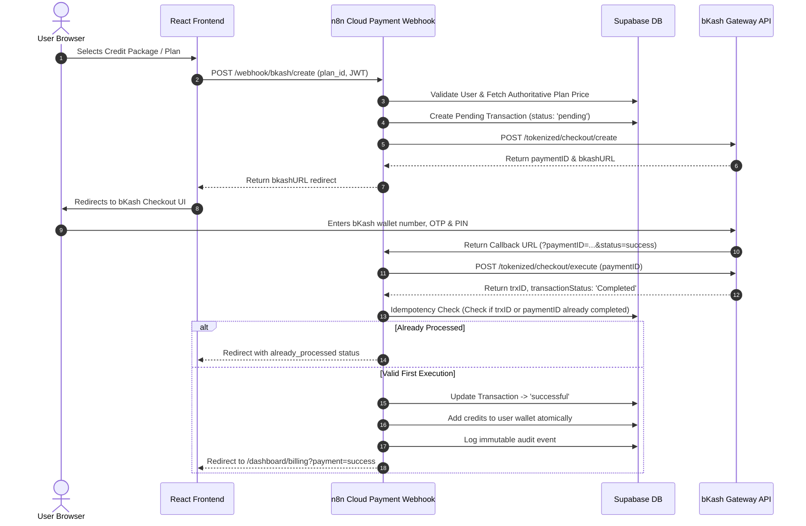

# bKash Payment Gateway Integration Guide — SnapCut AI

## 1. Overview
This document outlines the official bKash Merchant Payment Gateway integration architecture for SnapCut AI.
SnapCut AI utilizes the **Official bKash Tokenized Checkout API v2.0** for processing credit pack purchases and subscriptions in Bangladeshi Taka (BDT).

> [!IMPORTANT]
> **Strict Policy**: No manual "Send Money", personal bKash numbers, fake payment simulations, scraping, or unofficial APIs are permitted. If official documentation or merchant credentials are being procured, all integration points adhere strictly to the sandbox and live gateway specifications.

---

## 2. bKash Gateway Architecture & Credentials

The integration requires the following Merchant credentials provided by bKash:
- **App Key** (`BKASH_APP_KEY`)
- **App Secret** (`BKASH_APP_SECRET`)
- **Merchant Username** (`BKASH_USERNAME`)
- **Merchant Password** (`BKASH_PASSWORD`)
- **Base URL**:
  - Sandbox: `https://tokenized.sandbox.bka.sh/v2.0`
  - Production: `https://tokenized.pay.bka.sh/v2.0`

---

## 3. End-to-End Payment Sequence



---

## 4. Idempotency & Duplicate Callback Protection

To prevent double-crediting if bKash sends duplicate callbacks or a user triggers multiple browser returns:
1. Every payment has a unique `paymentID` and `trxID`.
2. Database column `provider_payment_id` has a unique constraint.
3. n8n executes a database check:
   ```sql
   SELECT status FROM transactions WHERE provider_payment_id = $paymentID;
   ```
4. If status is already `'successful'`, the credit addition step is completely bypassed.

---

## 5. Testing & Verification Checklist

- [ ] Sandbox Token Generation (`POST /tokenized/checkout/token/grant`)
- [ ] Create Payment request validation
- [ ] Execute Payment request validation
- [ ] Query Payment status verification (`POST /tokenized/checkout/payment/search/`)
- [ ] Refund handling workflow (`POST /tokenized/checkout/payment/refund`)
- [ ] Webhook error state handling (insufficient funds, user canceled, OTP timeout)
